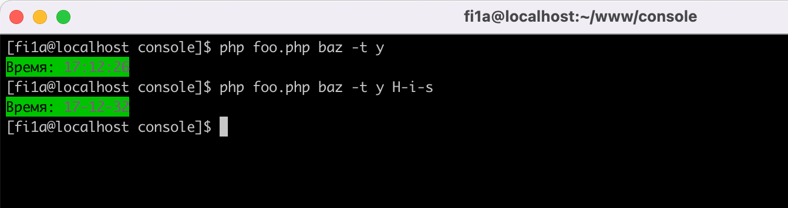
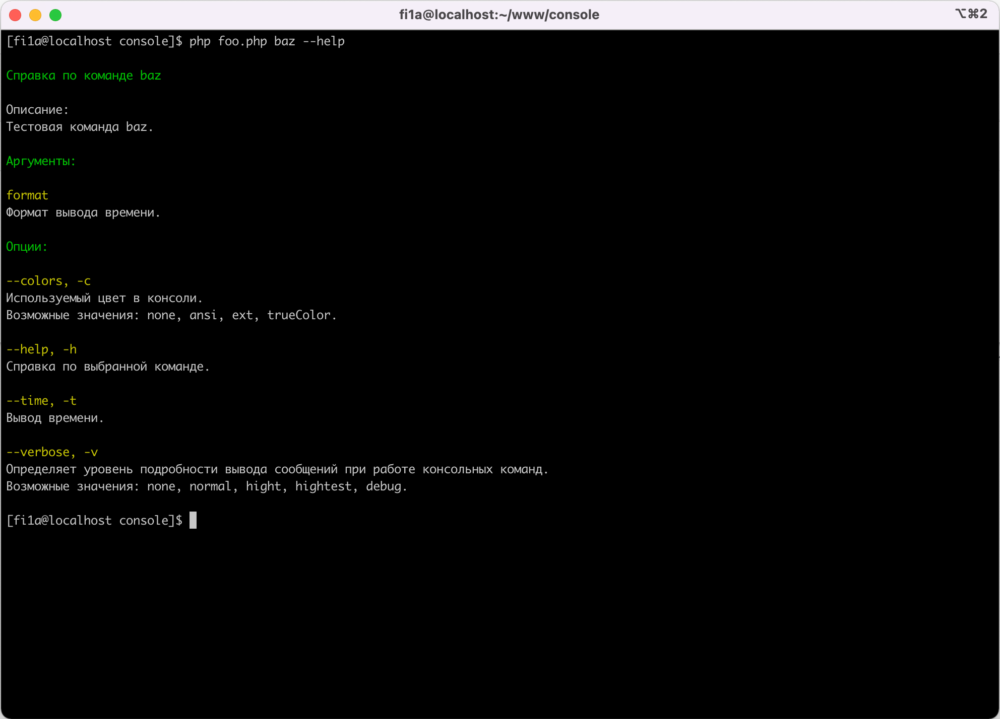
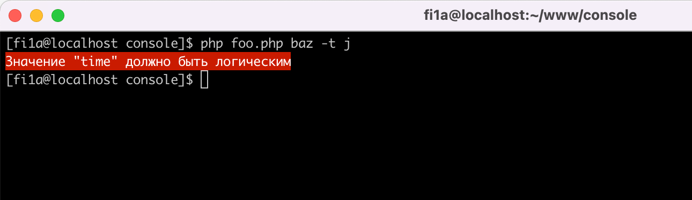
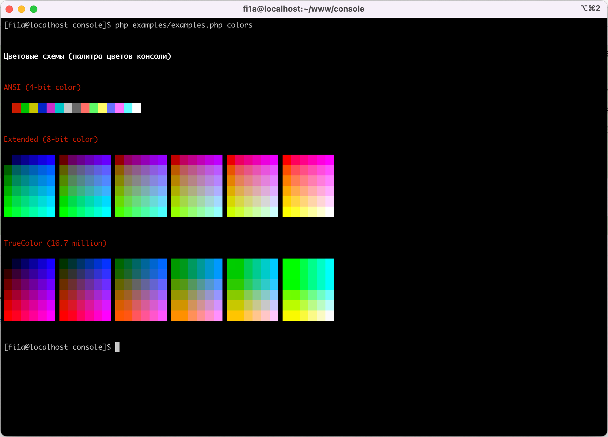

# Консольные команды на PHP. Аргументы, опции и форматирование

[![Latest Version][badge-release]][packagist]
[![Software License][badge-license]][license]
[![PHP Version][badge-php]][php]
![Coverage Status][badge-coverage]
[![Total Downloads][badge-downloads]][downloads]

Возможности:

- Команды получают автоматическую поддержку --help для вывода справки;
- Поддержка одной или нескольких команд;
- Возможность валидации (проверки) значений передаваемых в качестве аргументов и опций в команду;
- Цветовое оформление в консоли;
- Компоненты реализующие таблицы, списки, деревья и т.д.

## Установка

Установить этот пакет можно как зависимость, используя Composer.

``` bash
composer require fi1a/console ~1.0
```

## Использование

### Команды, аргументы и опции в консоли

Класс ```Fi1a\Console\App``` предоставляет удобный интерфейс для добавления команд и запуска приложения.

#### Команды

Команда должна реализовывать интерфейс ```Fi1a\Console\CommandInterface```.
Вот пример простой команды.

```php

declare(strict_types=1);

namespace Foo\Bar;

/**
 * Простая команда
 */
class BazCommand extends AbstractCommand
{
    /**
     * @inheritDoc
     */
    public function __construct(DefinitionInterface $definition)
    {
        $definition->addOption('time', 't')
            ->default(false)
            ->description('Вывод времени.')
            ->validation()
            ->allOf()
            ->boolean();

        $definition->addArgument('format')
            ->default('H:i:s')
            ->description('Формат вывода времени.');
    }

    /**
     * @inheritDoc
     */
    public function run(
        InputArgumentsInterface $input,
        ConsoleOutputInterface $output,
        InputInterface $stream,
        DefinitionInterface $definition,
        AppInterface $app
    ): int {
        $output->writeln('<option=bold>Пример команды</>');
        
        if ($definition->getOption('time')->getValue()) {
            $output->writeln(
                '<success>Серверное время: <option=bold>{{time}}</></success>',
                ['time' => date($definition->getArgument('format')->getValue())]
            );
        }
        
        return 0;
    }

    /**
     * @inheritDoc
     */
    public function description(): ?string
    {
        return 'Тестовая команда baz.';
    }
}
```

В этом примере добавляется опция ```time``` и аргумент ```format``` в конструкторе команды.
После запуска команды проверяется передана ли опция ```time``` и если передана выводит серверное время
с указанным форматом ```format```. Если формат не передан, метод ```getValue```
вернет значение указанное по умолчанию с помощью метода ```default```.



В метод ```run``` вызываемый при запуске команды в качестве аргументов передается:
- ```InputArgumentsInterface $input``` - входящие аргументы и опции;
- ```ConsoleOutputInterface $output``` - вывод в консоль;
- ```InputInterface $stream``` -  потоковый ввод из консоли;
- ```DefinitionInterface $definition``` - доступ к объявленным аргументам и опциям;
- ```AppInterface $app``` - объект класса ```Fi1a\Console\App``` вызвавший данную команду.
  
#### Запуск консольного приложения

Запуск одной конкретной команды.
Данный код запустит команду ```\Foo\Bar\BazCommand``` на выполнение:

```php

declare(strict_types=1);

use Fi1a\Console\App;

$code = (new App())
    ->run(\Foo\Bar\BazCommand::class);

exit($code);
```

Запуск нескольких команд указанных в первом аргументе.
При вызове ```php foo.php``` будут выведены на экран все доступные команды.
Если передать в качестве первого аргумента название команды ```php foo.php qux```
будет запущена команда ```\Foo\Bar\QuxCommand```.

```php

declare(strict_types=1);

use Fi1a\Console\App;

$code = (new App())
    ->addCommand('baz', \Foo\Bar\BazCommand::class)
    ->addCommand('qux', \Foo\Bar\QuxCommand::class)
    ->run();

exit($code);
```

#### Отображение справки

Если вызвать пример с параметром --help (```php foo.php baz --help```), можно увидеть следующую справку:



Описание команды берется из значения возвращаемого методом ```description```.

#### Отображение ошибок

Допустим, вы вызываете пример ```php foo.php baz -t j```. Вы увидите следующее сообщение об ошибке:



Валидация осуществляется с помощью пакета [fi1a/validation](https://github.com/fi1a/validation).
Доступны все правила валидации.

```php
$definition->addOption('option1')
    ->validation()
    ->allOf()
    ->required()
    ->min(10)
    ->max(20);

$argument = $definition->addArgument('argument1')
    ->multiple();

$argument->multipleValidation()
    ->allOf()
    ->array()
    ->required()
    ->minCount(2);

$argument->validation()
    ->allOf()
    ->required()
    ->min(10)
    ->max(20);
```

- метод ```validation``` - правила валидации одного значения;
- метод ```multipleValidation``` - правила валидации множества значений.

### Оформление и компоненты

#### Цветовые схемы (палитра цветов консоли):

Доступны три цветовые схемы:

- ANSI (4-bit color);
- Extended (8-bit color);
- TrueColor (16.7 million).

Запустить пример с отображением палитры цветов

```shell
php examples/examples.php colors
```



[badge-release]: https://img.shields.io/packagist/v/fi1a/console?label=release
[badge-license]: https://img.shields.io/github/license/fi1a/console?style=flat-square
[badge-php]: https://img.shields.io/packagist/php-v/fi1a/console?style=flat-square
[badge-coverage]: https://img.shields.io/badge/coverage-100%25-green
[badge-downloads]: https://img.shields.io/packagist/dt/fi1a/console.svg?style=flat-square&colorB=mediumvioletred

[packagist]: https://packagist.org/packages/fi1a/console
[license]: https://github.com/fi1a/console/blob/master/LICENSE
[php]: https://php.net
[downloads]: https://packagist.org/packages/fi1a/console