# Консольные команды на PHP. Аргументы, опции и форматирование

[![Latest Version][badge-release]][packagist]
[![Software License][badge-license]][license]
[![PHP Version][badge-php]][php]
![Coverage Status][badge-coverage]
[![Total Downloads][badge-downloads]][downloads]
[![Support mail][badge-mail]][mail]

Библиотека PHP для реализации команд и красивого форматирования текста в консоли.

Возможности:

- Команды получают автоматическую поддержку --help для вывода справки;
- Поддержка одной или нескольких команд;
- Возможность валидации (проверки) значений передаваемых в качестве аргументов и опций в команду;
- Цветовое оформление в консоли;
- Компоненты реализующие таблицы, списки, деревья и т.д.

## Установка

Установить этот пакет можно как зависимость, используя Composer.

``` bash
composer require fi1a/console
```

## Использование

### Команды, аргументы и опции в консоли

Класс ```Fi1a\Console\App``` предоставляет удобный интерфейс для добавления команд и запуска приложения.

#### Команды

Команда должна реализовывать интерфейс ```Fi1a\Console\CommandInterface```.
Вот пример простой команды.

```php

declare(strict_types=1);

namespace Foo\Bar;

/**
 * Простая команда
 */
class BazCommand extends AbstractCommand
{
    /**
     * @inheritDoc
     */
    public function __construct(DefinitionInterface $definition)
    {
        $definition->addOption('time', 't')
            ->default(false)
            ->description('Вывод времени.')
            ->validation()
            ->allOf()
            ->boolean();

        $definition->addArgument('format')
            ->default('H:i:s')
            ->description('Формат вывода времени.');
    }

    /**
     * @inheritDoc
     */
    public function run(
        InputArgumentsInterface $input,
        ConsoleOutputInterface $output,
        InputInterface $stream,
        DefinitionInterface $definition,
        AppInterface $app
    ): int {
        $output->writeln('<option=bold>Пример команды</>');
        
        if ($definition->getOption('time')->getValue()) {
            $output->writeln(
                '<success>Серверное время: <option=bold>{{time}}</></success>',
                ['time' => date($definition->getArgument('format')->getValue())]
            );
        }
        
        return 0;
    }

    /**
     * @inheritDoc
     */
    public function description(): ?string
    {
        return 'Тестовая команда baz.';
    }
}
```

В этом примере добавляется опция ```time``` и аргумент ```format``` в конструкторе команды.
После запуска команды проверяется передана ли опция ```time``` и если передана, выводит серверное время
с указанным форматом ```format```. Если формат не передан, метод ```getValue```
вернет значение указанное по умолчанию с помощью метода ```default```.

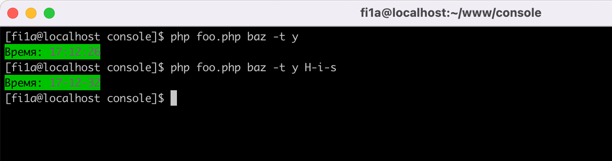

В метод ```run``` вызываемый при запуске команды в качестве аргументов передается:
- ```InputArgumentsInterface $input``` - входящие аргументы и опции;
- ```ConsoleOutputInterface $output``` - вывод в консоль;
- ```InputInterface $stream``` -  потоковый ввод из консоли;
- ```DefinitionInterface $definition``` - доступ к объявленным аргументам и опциям;
- ```AppInterface $app``` - объект класса ```Fi1a\Console\App```, вызвавший данную команду.

#### Использование опций и аргументов

В метод ```run``` передается объект класса ```DefinitionInterface $definition```, который можно
использовать для доступа к значениям опций и аргументов.

```php
$definition->getOption('time')->getValue();
$definition->getArgument('format')->getValue();
```

- Опции передаются с помощью --name=value полного имени или -s value короткого кода;
- Аргументы передаются как строки, разделенные пробелами.

#### Запуск консольного приложения

Чтобы использовать приложение, нужно вызвать метод ```run```.
Метод ```run``` делает следующее:

- Анализирует параметр $argv для определения команды;
- Валидирует опции и аргументы;
- Осуществляет конфигурацию команды;
- Запускает команду на выполнение.

Запуск одной конкретной команды.
Данный код запустит команду ```\Foo\Bar\BazCommand``` на выполнение:

```php

declare(strict_types=1);

use Fi1a\Console\App;

$code = (new App())
    ->run(\Foo\Bar\BazCommand::class);

exit($code);
```

Запуск нескольких команд, указанных в первом аргументе.
Если передать в качестве первого аргумента название команды ```php foo.php qux```,
будет запущена команда ```\Foo\Bar\QuxCommand```.

```php

declare(strict_types=1);

use Fi1a\Console\App;

$code = (new App())
    ->addCommand('baz', \Foo\Bar\BazCommand::class)
    ->addCommand('qux', \Foo\Bar\QuxCommand::class)
    ->run();

exit($code);
```

#### Список команд

Вызов скрипта, который имеет несколько команд без параметров или только с аргументом info,
отобразит список доступных команд. Пример:

```php foo.php``` или ```php foo.php info```

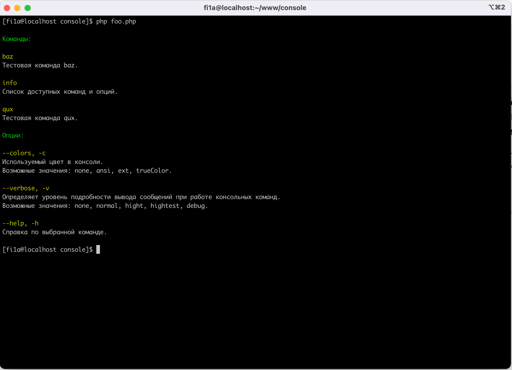

Описание команды берется из значения, возвращаемого методом ```description```.

#### Отображение справки

Если вызвать команду с параметром --help (```php foo.php baz --help```), можно увидеть следующую справку по команде:

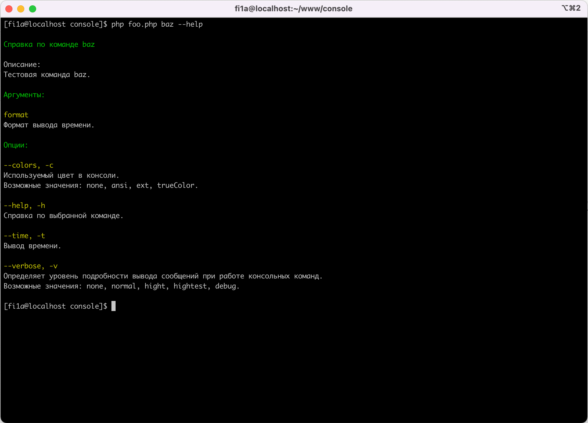

Описание команды берется из значения, возвращаемого методом ```description```.

#### Отображение ошибок


Допустим, вы вызываете пример ```php foo.php baz -t j```:

```php
$definition->addOption('time', 't')
    ->default(false)
    ->description('Вывод времени.')
    ->validation()
    ->allOf()
    ->boolean();
    
$definition->addArgument('format')
    ->default('H:i:s')
    ->description('Формат вывода времени.');
```

Увидете следующее сообщение об ошибке:

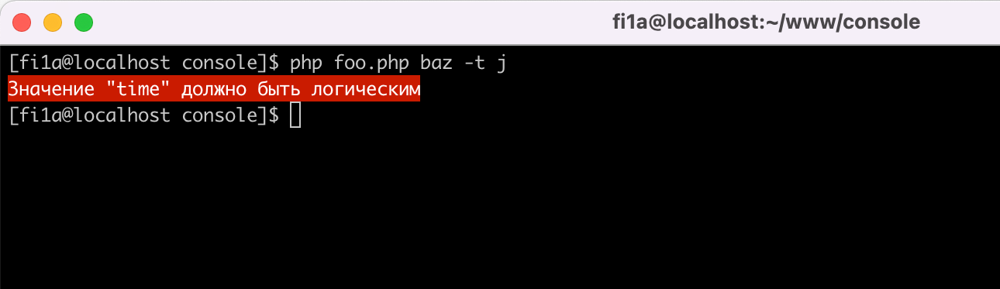

Валидация осуществляется с помощью пакета [fi1a/validation](https://github.com/fi1a/validation).
Доступны все правила валидации.

```php
$definition->addOption('option1')
    ->validation()
    ->allOf()
    ->required()
    ->min(10)
    ->max(20);

$argument = $definition->addArgument('argument1')
    ->multiple();

$argument->multipleValidation()
    ->allOf()
    ->array()
    ->required()
    ->minCount(2);

$argument->validation()
    ->allOf()
    ->required()
    ->min(10)
    ->max(20);
```

- метод ```validation``` - правила валидации одного значения;
- метод ```multipleValidation``` - правила валидации множества значений.

### Оформление

#### Цветовые схемы (палитра цветов консоли):

Доступны три цветовые схемы:

- ANSI (4-bit color);
- Extended (8-bit color);
- TrueColor (16.7 million).

Запустить пример с отображением палитры цветов

```shell
php examples/examples.php colors
```

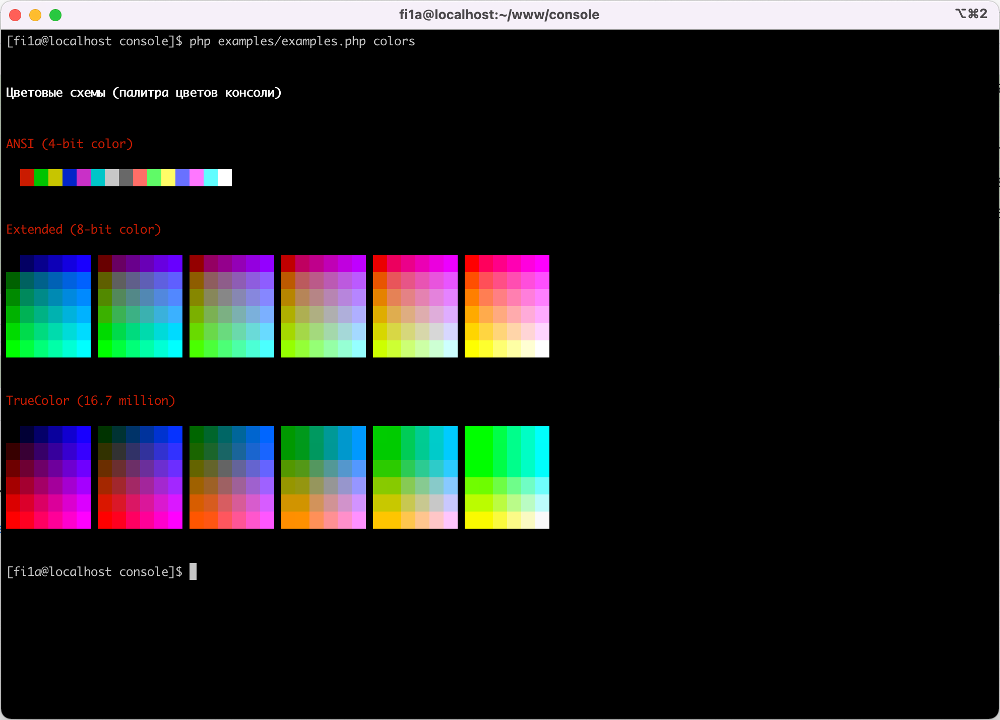

#### Вывод в консоль

Используя цвета в выводе консоли, вы можете оформить разные типы вывода (ошибки, заголовки, комментарии и т. д.).

##### Использование цветовых стилей

При выводе можно использовать теги, чтобы раскрасить отображаемый текст.

```php

...

/**
 * @inheritDoc
 */
public function run(
    InputArgumentsInterface $input,
    ConsoleOutputInterface $output,
    InputInterface $stream,
    DefinitionInterface $definition,
    AppInterface $app
): int {
    $output->writeln('<info>foo</info>');
    $output->writeln('<error>bar</error>');
    $output->writeln('<success>baz<info>qux</info></success>');
}

...

```

Можно определить свои собственные стили, используя метод ```addStyle``` класса ```Fi1a\Console\IO\Formatter```:

```php
use Fi1a\Console\IO\Formatter;
use Fi1a\Console\IO\Style\TrueColor;
use Fi1a\Console\IO\Style\TrueColorStyle;

Formatter::addStyle('error', new TrueColorStyle(TrueColor::WHITE, TrueColor::RED));
```

Любой шестнадцатеричный цвет поддерживается для цветов схемы TrueColor.
Кроме того, поддерживаются названные цвета, опредяемых константами интерфейса
```Fi1a\Console\IO\Style\ColorInterface``` (```ColorInterface::BLACK```, ```ColorInterface::RED```, ```ColorInterface::GREEN``` ...).

Если терминал не поддерживает TrueColor или Extended, используется ближайший ANSI цвет.

Доступны параметры оформления: blink, bold, conceal, reverse, underscore.
Вы можете установить цвет, фон и параметры непосредственно внутри тега. Поддерживается вложенность стилей.

```php

...

/**
 * @inheritDoc
 */
public function run(
    InputArgumentsInterface $input,
    ConsoleOutputInterface $output,
    InputInterface $stream,
    DefinitionInterface $definition,
    AppInterface $app
): int {
    $output->writeln('<color=black>foo</>');
    $output->writeln('<bg=white;color=black>bar</>');
    $output->writeln('<color=red>baz<option=bold,underscore>qux</></>');
}

...

```

Запустить пример с отображением форматированного вывода

```shell
php examples/examples.php output
```

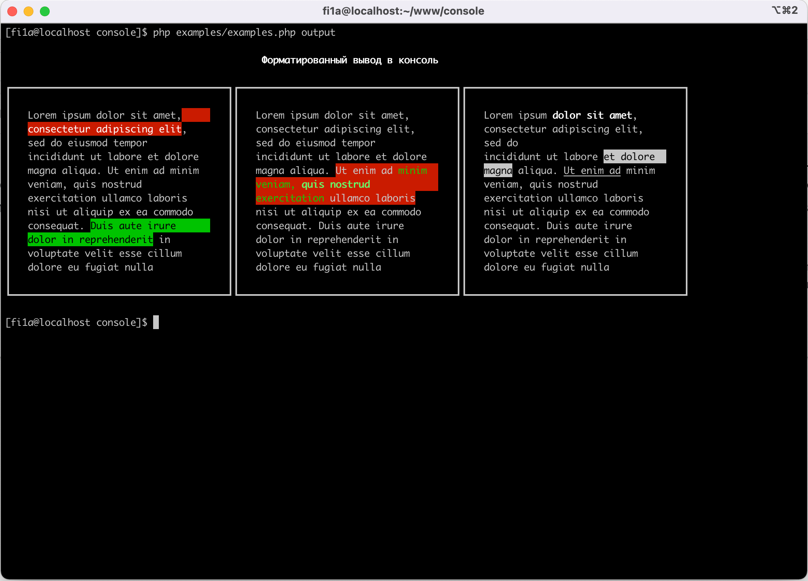

#### Потоковый ввод из консоли

Чтение (ввод) из консоли осуществляется методом ```read``` объекта класса ```InputInterface $stream```.

```php

...

/**
 * @inheritDoc
 */
public function run(
    InputArgumentsInterface $input,
    ConsoleOutputInterface $output,
    InputInterface $stream,
    DefinitionInterface $definition,
    AppInterface $app
): int {
    $value = $stream->read('y');
}

...

```

#### Интерактивный ввод из консоли

С помощью класса ```Fi1a\Console\IO\InteractiveInput```, можно добавить значения для чтения
из консоли и получить последующий доступ к введенным значениям. 
С помощью метода ```addValue``` добавляем значение для чтения из консоли. Также как для аргументов
и опций, доступны валидаторы значений из пакета [fi1a/validation](https://github.com/fi1a/validation)

```php

use Fi1a\Console\IO\InteractiveInput;

...

/**
 * @inheritDoc
 * @psalm-suppress PossiblyFalseReference
 * @psalm-suppress MixedMethodCall
 */
public function run(
    InputArgumentsInterface $input,
    ConsoleOutputInterface $output,
    InputInterface $stream,
    DefinitionInterface $definition,
    AppInterface $app
): int {
    $output->writeln(['', '<option=bold>Интерактивный ввод</>', '']);

    $interactive = new InteractiveInput($output, $stream);

    $interactive->addValue('foo')
        ->description('Введите количество от 1 до 10')
        ->validation()
        ->allOf()
        ->min(1)
        ->max(10);

    $bar = $interactive->addValue('bar')
        ->description('Введите строки длиной от 2-х символов')
        ->multiple();

    $bar->multipleValidation()
        ->allOf()
        ->minCount(1)
        ->required();

    $bar->validation()
        ->allOf()
        ->minLength(2);

    $interactive->addValue('baz')
        ->description('Согласны (y/n)')
        ->validation()
        ->allOf()
        ->boolean();

    $interactive->read();

    // Доступ к введенным значениям
    $output->writeln((string) $interactive->getValue('foo')->getValue());
    $output->writeln((string) count((array) $interactive->getValue('bar')->getValue()));
    $output->writeln((string) $interactive->getValue('baz')->getValue());

    return 0;
}

...

```

Запустить пример с интерактивным вводом

```shell
php examples/examples.php interactive
```

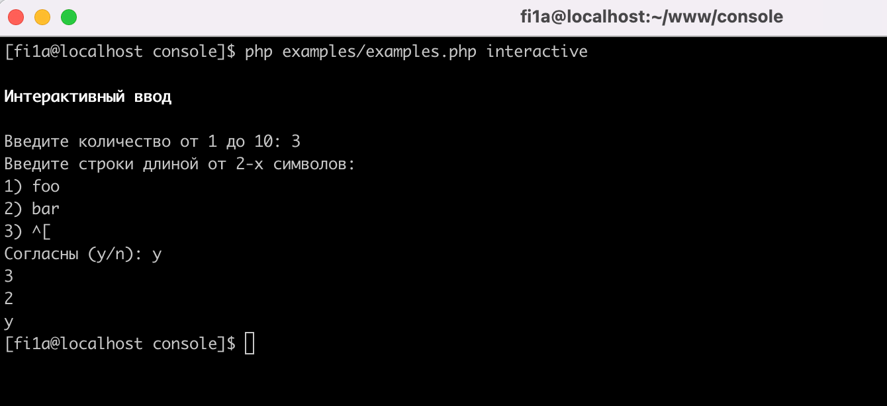

### Компоненты

#### Компонент панели

Чтобы нарисовать границу  вокруг текста или задать выравнивание, используйте ```Fi1a\Console\Component\PanelComponent\PanelComponent```.
Компонент панели может быть вложен друг в друга.

```php

use Fi1a\Console\Component\PanelComponent\PanelComponent;
use Fi1a\Console\Component\PanelComponent\PanelStyle;
use Fi1a\Console\Component\PanelComponent\PanelStyleInterface;
use Fi1a\Console\IO\Style\ColorInterface;

...

/**
 * @inheritDoc
 */
public function run(
    InputArgumentsInterface $input,
    ConsoleOutputInterface $output,
    InputInterface $stream,
    DefinitionInterface $definition,
    AppInterface $app
): int {
    $panelStyle = new PanelStyle();

    $panelStyle->setWidth(40)
        ->setPadding(1)
        ->setBorder('heavy')
        ->setBackgroundColor(ColorInterface::YELLOW)
        ->setBorderColor(ColorInterface::RED)
        ->setColor(ColorInterface::BLACK)
        ->setAlign(PanelStyleInterface::ALIGN_CENTER);

    $panel = new PanelComponent(
        $output,
        'Lorem ipsum dolor sit amet, <error>consectetur adipiscing elit</error>, '
        . 'sed do eiusmod tempor incididunt ut labore et dolore magna aliqua.',
        $panelStyle
    );

    $panel->display();

    return 0;
}

...

```

Запустить пример с отображением панелей

```shell
php examples/examples.php panel
```

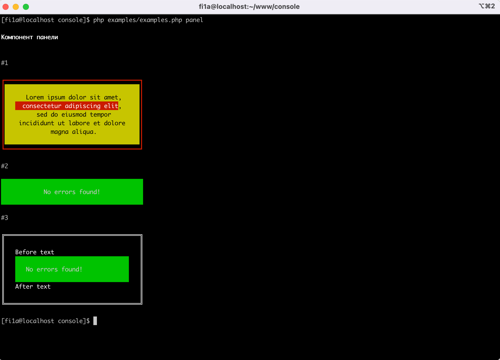

Вы можете изменить стиль границы панели, задав одно из следующих значений:

- ascii;
- double;
- heavy;
- horizontals;
- rounded.

Запустить пример со стилями границ панели

```shell
php examples/examples.php panel-borders
```

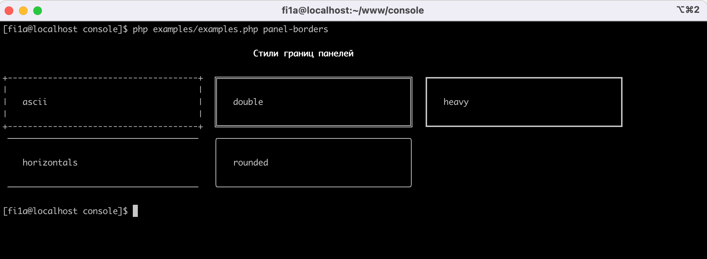

Можно определить свои собственные стили границ, используя метод ```add``` класса ```Fi1a\Console\Component\PanelComponent\BorderRegistry```.
Класс стиля границ должен реализовать интерфейс ```Fi1a\Console\Component\PanelComponent\BorderInterface```:

```php

use Fi1a\Console\Component\PanelComponent\AsciiBorder;
use Fi1a\Console\Component\PanelComponent\BorderRegistry;

BorderRegistry::add(
    'ascii',
    new AsciiBorder()
);
```

#### Компонент группы

Чтобы панели были одной высоты и располагались на одной линии, можно использовать компонент группы.

```php

use Fi1a\Console\Component\GroupComponent\GroupComponent;
use Fi1a\Console\Component\GroupComponent\GroupStyle;
use Fi1a\Console\Component\PanelComponent\PanelComponent;
use Fi1a\Console\Component\PanelComponent\PanelStyle;

...

/**
 * @inheritDoc
 */
public function run(
    InputArgumentsInterface $input,
    ConsoleOutputInterface $output,
    InputInterface $stream,
    DefinitionInterface $definition,
    AppInterface $app
): int {
    $groupStyle = new GroupStyle(40);
    $groupStyle->setPanelSpacing(2);
    $group = new GroupComponent($output, $groupStyle);

    $panelStyle = new PanelStyle();
    $panelStyle->setBorder('heavy')
        ->setPadding(1);

    $panel1 = new PanelComponent(
        $output,
        'Lorem ipsum dolor sit amet, consectetur adipiscing elit, '
        . 'sed do eiusmod tempor incididunt ut '
        . 'labore et dolore magna aliqua. Ut enim ad minim veniam, quis nostrud exercitation ullamco laboris '
        . 'nisi ut aliquip ex ea commodo consequat. Duis aute irure dolor in reprehenderit '
        . 'in voluptate velit esse cillum dolore eu fugiat nulla pariatur. Excepteur sint occaecat cupidatat '
        . 'non proident, sunt in culpa qui officia deserunt mollit anim id est laborum.',
        $panelStyle
    );
    $panel2 = new PanelComponent(
        $output,
        'Lorem ipsum dolor sit amet, consectetur adipiscing elit, '
        . 'sed do eiusmod tempor incididunt ut '
        . 'labore et dolore magna aliqua. Ut enim ad minim veniam, quis nostrud exercitation ullamco laboris '
        . 'nisi ut aliquip ex ea commodo consequat. Duis aute irure dolor in reprehenderit '
        . 'in voluptate velit esse cillum dolore eu fugiat nulla pariatur.',
        $panelStyle
    );
    $panel3 = new PanelComponent(
        $output,
        'Lorem ipsum dolor sit amet, consectetur adipiscing elit, '
        . 'sed do eiusmod tempor incididunt ut labore et dolore magna aliqua.',
        $panelStyle
    );

    $group->addPanel($panel1);
    $group->addPanel($panel2);
    $group->addPanel($panel3);

    $group->display();
        
    return 0;
}

...

```

Запустить пример с группой панелей

```shell
php examples/examples.php group
```

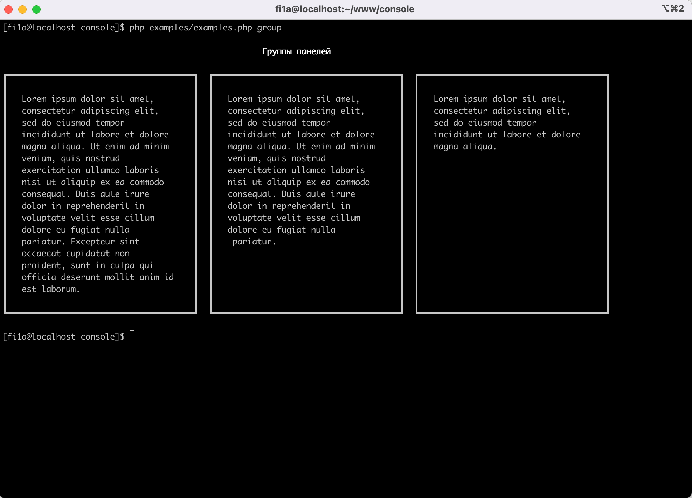

#### Компонент списка

Для отображения списка служит компонент ```Fi1a\Console\Component\ListComponent\ListComponent```.
Поддерживаются вложенные списки.

```php

use Fi1a\Console\Component\ListComponent\ListComponent;
use Fi1a\Console\Component\ListComponent\ListStyle;
use Fi1a\Console\Component\ListComponent\ListStyleInterface;
use Fi1a\Console\IO\Style\ColorInterface;

...

/**
 * @inheritDoc
 */
public function run(
    InputArgumentsInterface $input,
    ConsoleOutputInterface $output,
    InputInterface $stream,
    DefinitionInterface $definition,
    AppInterface $app
): int {
    $listStyle = new ListStyle();
    $listStyle->setType('upper-alpha')
        ->setMarkerColor(ColorInterface::GREEN);

    $subListStyle = new ListStyle();
    $subListStyle->setType('lower-alpha')
        ->setMarkerColor(ColorInterface::RED)
        ->setPosition(ListStyleInterface::POSITION_OUTSIDE);

    $subList = new ListComponent($output, $subListStyle);

    $subList->addItem('Lorem ipsum dolor sit amet');
    $subList->addItem('Consectetur adipiscing elit');

    $list = new ListComponent($output, $listStyle);

    $list->addItem('Lorem ipsum dolor sit amet');
    $list->addItem('Consectetur adipiscing elit');
    $list->addItem($subList);
    $list->addItem('Sed do eiusmod tempor incididunt');
    $list->addItem('Duis aute irure dolor in reprehenderit');
    $list->addItem('Reprehenderit in voluptate velit');

    $list->display();
    
    return 0;
}

...

```

Задать тип маркера можно с помощью метода ```setType``` класса стиля списка ```Fi1a\Console\Component\ListComponent\ListStyle```.

Доступны следующие типы маркеров:

- upper-alpha - алфавитный список заглавных букв (A, B, C, D, E, …);
- square - в качестве маркера выступает квадрат;
- lower-alpha - алфавитный список (a, b, c, d, e, …);
- decimal-leading-zero - порядковый номер с лидирующим нулем (01, 02, 03, 04, 05, …);
- decimal - порядковый номер (1, 2, 3, 4, 5, …);
- circle - в качестве маркера выступает незакрашенный кружок;
- disc - в качестве маркера элементов списка выступает закрашенный кружок.

Запустить пример со списками

```shell
php examples/examples.php list
```

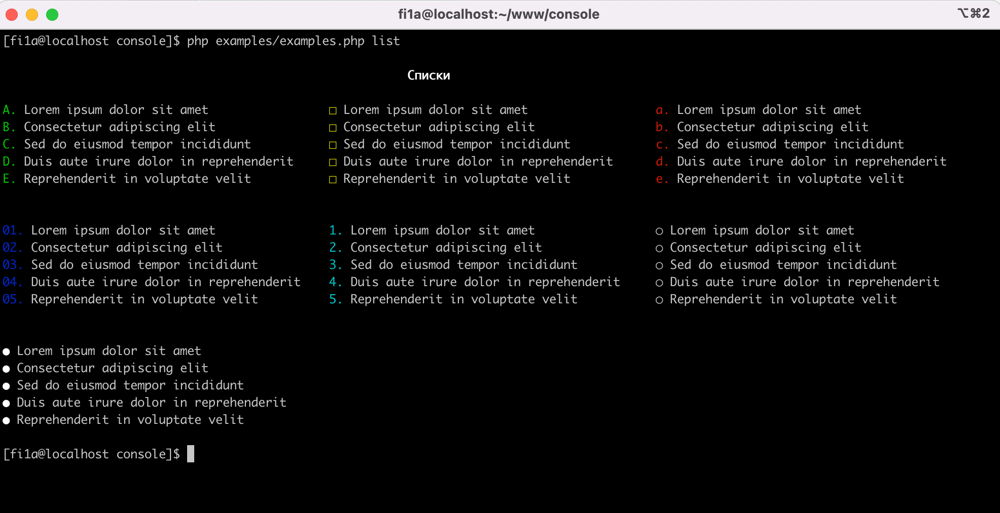

Можно определить свои собственные типы маркеров списков, используя метод ```add``` класса ```Fi1a\Console\Component\ListComponent\ListTypeRegistry```.
Класс типа маркера списка должен реализовать интерфейс ```Fi1a\Console\Component\ListComponent\ListTypeInterface```:

```php

use Fi1a\Console\Component\ListComponent\ListTypeRegistry;
use Fi1a\Console\Component\ListComponent\UpperAlphaListType;

ListTypeRegistry::add('upper-alpha', new UpperAlphaListType());
```

#### Компонент постраничной навигации

Если вам необходимо разбить вывод на страницы, можно воспользоваться компонентом постраничной навигации.

Пример:

```php

use Fi1a\Console\Component\PaginationComponent\PaginationComponent;
use Fi1a\Console\Component\PaginationComponent\PaginationStyle;
use Fi1a\Console\Component\TableComponent\TableComponent;
use Fi1a\Console\Component\TableComponent\TableStyle;

...

/**
 * @inheritDoc
 */
public function run(
    InputArgumentsInterface $input,
    ConsoleOutputInterface $output,
    InputInterface $stream,
    DefinitionInterface $definition,
    AppInterface $app
): int {
    $data = [
        ['Смартфон', '1000', '2', '2000'],
        ['Шкаф', '500', '1', '500'],
        ['Электробритва', '300', '5', '1500'],
        ['Станок', '200', '1', '200'],
        ['Диван', '1200', '1', '1200'],
        ['Кровать', '100', '2', '200'],
        ['Кресло', '300', '3', '900'],
        ['Шифанер', '150', '1', '150'],
        ['Стул', '50', '4', '200'],
        ['Стол', '100', '1', '100'],
    ];

    $tableStyle = new TableStyle();
    $table = new TableComponent($output, $tableStyle);
    $table->setHeaders(['Товар', 'Стоимость', 'Количество', 'Итоговая сумма']);
    $paginationStyle = new PaginationStyle();

    $pagination = new PaginationComponent($output, $stream, $paginationStyle);
    $pagination->setCount((int) ceil(count($data) / 3));
    $page = 1;
    do {
        $rows = array_slice($data, ($page - 1) * 3, 3);
        $table->setRows($rows);
        $table->display();
        $pagination->display();
        $page = $pagination->getCurrent();
    } while ($pagination->isValid());

    $output->writeln('');

    return 0;
}

...

```

Запустить пример c постраничной навигацией

```shell
php examples/examples.php pagination
```

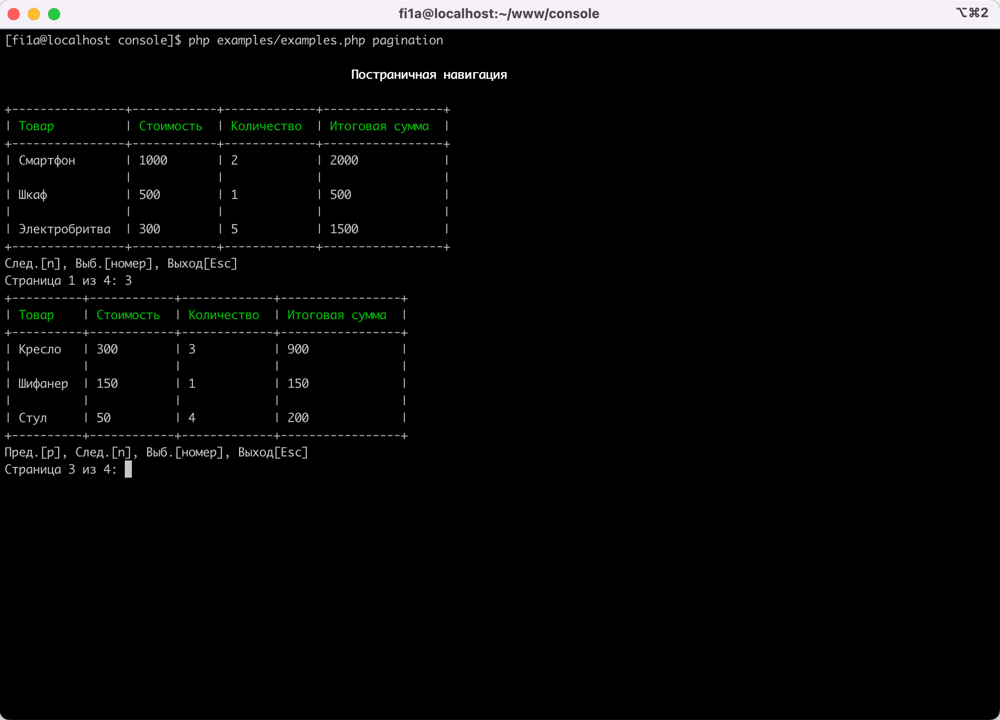

#### Компонент Progressbar

При выполнении длительных команд, полезно отображать информацию о ходе выполнения.

Чтобы отобразить сведения о ходе выполнения, используйте ```Fi1a\Console\Component\ProgressbarComponent\ProgressbarComponent```:

```php

use Fi1a\Console\Component\ProgressbarComponent\ProgressbarComponent;
use Fi1a\Console\Component\ProgressbarComponent\ProgressbarStyle;

...

/**
 * @inheritDoc
 */
public function run(
    InputArgumentsInterface $input,
    ConsoleOutputInterface $output,
    InputInterface $stream,
    DefinitionInterface $definition,
    AppInterface $app
): int {
    $progressbarStyle = new ProgressbarStyle();
    $progressbarStyle->setTemplateByName('full');
    $progressbar = new ProgressbarComponent($output, $progressbarStyle);

    $progressbar->start(10);
    do {
        $progressbar->increment();
        $progressbar->display();
        sleep(1);
    } while($progressbar->getProgress() < $progressbar->getMaxSteps());
    $progressbar->finish();
    $output->writeln(['', '']);

    return 0;
}

...

```

Используя метод ```setTemplateByName```, можно задать один из предустановленных шаблонов:

- short (```[{{bar}}]```);
- normal (```{{current}}/{{max}} [{{bar}}] {{percent|sprintf("3s")}}%{{if(title)}} {{title}}{{endif}}```);
- time (```[{{bar}}] {{elapsed|sprintf("10s")}} / {{remaining|sprintf("-10s")}}{{if(title)}} {{title}}{{endif}}```);
- memory (```[{{bar}}] {{memory|memory}}{{if(title)}} {{title}}{{endif}}```);
- full (```{{current}}/{{max}} [{{bar}}] {{percent|sprintf("3s")}}% {{elapsed|sprintf("10s")}} / {{remaining|sprintf("-10s")}} {{memory|memory}}{{if(title)}} {{title}}{{endif}}```).

Вы можете добавить свой шаблон, используя метод ```add```  класса ```Fi1a\Console\Component\ProgressbarComponent\ProgressbarTemplateRegistry```:

```php

use Fi1a\Console\Component\ProgressbarComponent\ProgressbarTemplateRegistry;

ProgressbarTemplateRegistry::add(
    'normal',
    '{{current}}/{{max}} [{{bar}}] {{percent|sprintf("3s")}}%{{if(title)}} {{title}}{{endif}}'
);
```

Запустить пример c progressbar'ом

```shell
php examples/examples.php progressbar
```

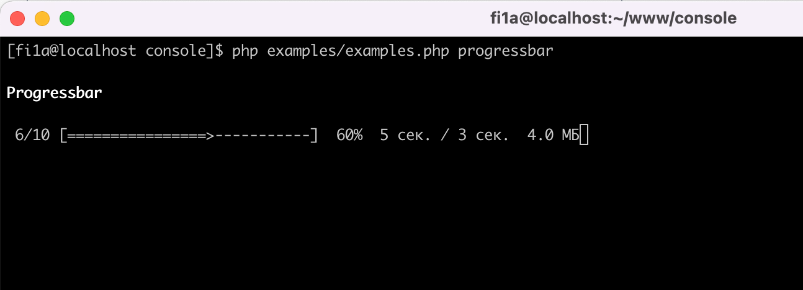

#### Компонент Spinner

Возможности:

- заголовок во время вращения;
- поддержка шаблона (```{{if(title)}}{{title}} {{endif}}<color=green>{{spinner}}</> ```);
- имеет метод ```clear```;
- различный внешний вид и возможность добавить свой spinner.

Внешний вид spinner'а:

- dots;
- line;
- growVertical;
- growHorizontal;
- bar.

Вы можете добавить свой spinner, используя метод ```add```  класса ```Fi1a\Console\Component\SpinnerComponent\SpinnerRegistry```.
Добавляемый spinner должен реализовать интерфейс ```Fi1a\Console\Component\SpinnerComponent\SpinnerInterface```:

```php

use Fi1a\Console\Component\SpinnerComponent\DotsSpinner;
use Fi1a\Console\Component\SpinnerComponent\SpinnerRegistry;

SpinnerRegistry::add('dots', new DotsSpinner());
```

Пример:

```php

use Fi1a\Console\Component\SpinnerComponent\SpinnerComponent;
use Fi1a\Console\Component\SpinnerComponent\SpinnerStyle;

...

/**
 * @inheritDoc
 */
public function run(
    InputArgumentsInterface $input,
    ConsoleOutputInterface $output,
    InputInterface $stream,
    DefinitionInterface $definition,
    AppInterface $app
): int {
    $spinnerStyle = new SpinnerStyle();
    $spinnerStyle->setTemplate('{{if(title)}}{{title}} {{endif}}<color=green>{{spinner}}</> ');

    $spinner = new SpinnerComponent($output, $spinnerStyle);

    $index = 0;
    do {
        if ($index % 1000000 === 0) {
            $title = $spinner->getTitle();
            if ($title) {
                $spinner->clear();
                $output->writeln($title);
            }
            $spinner->setTitle('In progress (' . $index . ')');
        }

        $spinner->display();
        $index++;
    } while ($index < 10000000);
    $output->writeln('');

    return 0;
}

...

```

Запустить пример

```shell
php examples/examples.php spinner
```

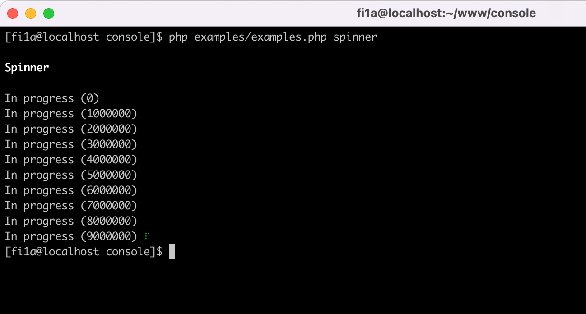

#### Компонент таблицы

Класс ```Fi1a\Console\Component\TableComponent\TableComponent``` предназначен для вывода табличных данных на терминал.

Чтобы отобразить таблицу, создайте объект ```Fi1a\Console\Component\TableComponent\TableComponent```, добавьте заголовоки с помощью ```setHeaders``` и строки с помощью ```setRows```,
а затем выведите на консоль методом ```display```:

```php

use Fi1a\Console\Component\TableComponent\TableComponent;
use Fi1a\Console\Component\TableComponent\TableStyle;

...

/**
 * @inheritDoc
 */
public function run(
    InputArgumentsInterface $input,
    ConsoleOutputInterface $output,
    InputInterface $stream,
    DefinitionInterface $definition,
    AppInterface $app
): int {
    $headers = ['Товар', 'Стоимость', 'Количество', 'Итоговая сумма'];
    $rows = [
        ['Смартфон', '1000', '2', '2000'],
        ['Шкаф', '500', '1', '500'],
    ];

    $tableStyle = new TableStyle();
    $tableStyle->setBorder('ascii')
        ->setWidth(50);

    $table = new TableComponent($output, $tableStyle);
    $table->setHeaders($headers);
    $table->setRows($rows);

    $table->display();
    
    return 0;
}

...

```

Если ширина таблицы не задана, то ширина колонок рассчитывается исходя из содержимого ячеек.

Свойства ячейки:

- value - значение;
- colspan - кол-во столбцов  ячейки;
- style - стиль ```Fi1a\Console\Component\TableComponent\TableCellStyleInterface```.

```php
use Fi1a\Console\Component\TableComponent\TableCell;
use Fi1a\Console\Component\TableComponent\TableCellStyle;
use Fi1a\Console\Component\TableComponent\TableCellStyleInterface;

$style = new TableCellStyle();
$style->setAlign(TableCellStyleInterface::ALIGN_CENTER)

$cell = new TableCell([
    'value' => 'foo',
    'colspan' => 2,
    'style' => $style,
]);
```

Вы можете установить стиль границы таблицы, задав одно из следующих значений c помощью метода
```setBorder``` объекта стиля ```Fi1a\Console\Component\TableComponent\TableStyle```:

- none;
- ascii;
- ascii_compact;
- double;
- double_compact;
- heavy;
- heavy_compact;
- horizontals;
- rounded;
- rounded_compact.

Запустить пример

```shell
php examples/examples.php table
```

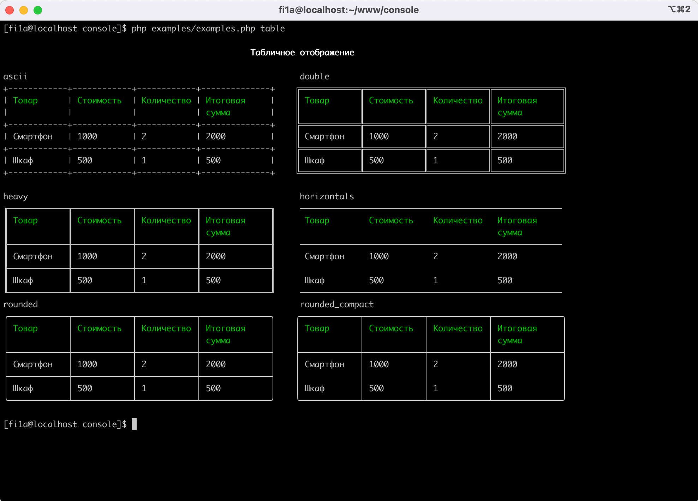

Можно определить свои собственные стили границ, используя метод ```add``` класса ```Fi1a\Console\Component\TableComponent\BorderRegistry```.
Класс стиля границ должен реализовать интерфейс ```Fi1a\Console\Component\TableComponent\BorderInterface```:

```php

use Fi1a\Console\Component\TableComponent\BorderRegistry;

BorderRegistry::add('none', new NoneBorder());
```

#### Компонент отображения дерева

Класс ```Fi1a\Console\Component\TreeComponent\TreeComponent``` может генерировать древовидное представление в терминале.
Дерево — отличный способ представления содержимого файловой системы или любых других иерархических данных.

```php

use Fi1a\Console\Component\TreeComponent\TreeComponent;
use Fi1a\Console\Component\TreeComponent\TreeStyle;

...

/**
 * @inheritDoc
 */
public function run(
    InputArgumentsInterface $input,
    ConsoleOutputInterface $output,
    InputInterface $stream,
    DefinitionInterface $definition,
    AppInterface $app
): int {
    $style = new TreeStyle();
    $style->setWidth(20)
        ->setLine('heavy');

    $tree = new TreeComponent($output);

    $node1 = $tree->addNode('Lorem ipsum dolor', $style);
    $node1->addNode('Ex ea commodo consequat', $style);
    $node2 = $tree->addNode('Consectetur adipiscing elit', $style);
    $node3 = $node2->addNode('Ex ea commodo consequat', $style);
    $node2->addNode('Sunt in culpa qui officia', $style);
    $node3->addNode('Ut aliquip ex ea commodo');
    $node3->addNode('Sunt in culpa qui officia');
    $tree->addNode('Ut enim ad minim veniam', $style);

    $tree->display();
    
    return 0;
}

...

```

Вы можете установить стиль линии, задав одно из следующих значений c помощью метода
```setLine``` объекта стиля ```Fi1a\Console\Component\TreeComponent\TreeStyle```:

- normal;
- double;
- heavy;
- ascii.

Запустить пример

```shell
php examples/examples.php tree
```

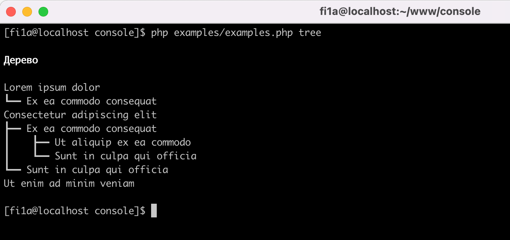

Можно определить свои собственные стили линий, используя метод ```add``` класса ```Fi1a\Console\Component\TreeComponent\LineRegistry```.
Класс стиля линии должен реализовать интерфейс ```Fi1a\Console\Component\TreeComponent\LineInterface```:

```php
use Fi1a\Console\Component\TreeComponent\LineRegistry;
use Fi1a\Console\Component\TreeComponent\NormalLine;

LineRegistry::add('normal', new NormalLine());
```

[badge-release]: https://img.shields.io/packagist/v/fi1a/console?label=release
[badge-license]: https://img.shields.io/github/license/fi1a/console?style=flat-square
[badge-php]: https://img.shields.io/packagist/php-v/fi1a/console?style=flat-square
[badge-coverage]: https://img.shields.io/badge/coverage-100%25-green
[badge-downloads]: https://img.shields.io/packagist/dt/fi1a/console.svg?style=flat-square&colorB=mediumvioletred
[badge-mail]: https://img.shields.io/badge/mail-support%40fi1a.ru-brightgreen

[packagist]: https://packagist.org/packages/fi1a/console
[license]: https://github.com/fi1a/console/blob/master/LICENSE
[php]: https://php.net
[downloads]: https://packagist.org/packages/fi1a/console
[mail]: mailto:support@fi1a.ru